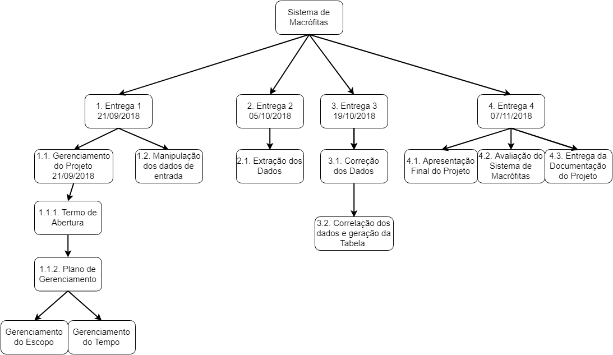

### Histórico de Revisão

| Data | Versão | Descrição | Autor(es) |
| :---: | :---: | --- | :---: |
| 04/09/2018 | 1.0 | Inicio do Documento | Eduardo / Caio / Gabriel|
| 11/09/2018 | 1.0.1 | Adição de novas informações e correções. | Caio Nakai / Eduardo Nakai|
| 13/09/2018 | 1.0.2 | Revisão | Caio Nakai / Gabriel Choptian|
| 20/09/2018 | 1.0.3 | Acréscimo de Informações | Caio Nakai
| 21/09/2018 | 1.0.4 | Atualização do Sumário | Gabriel
## Sumário

1. [Objetivo deste documento](#1-Objetivo-deste-documento)
2. [Planejamento e Gerenciamento do Escopo](#2-planejamento-e-gerenciamento-do-escopo)    
3. [Requisitos do Sistema](#3-requisitos-do-sistema)    
  3.1. [Ferramentas Utilizadas](#31-processo-de-alteração-dos-requisitos)      
  3.2. [Matriz de Rastreabilidade dos Requisitos](#33-forma-de-utilização-do-github)    
4. [EAP](#4-eap)    
5. [Definição do escopo](#5-definição-do-escopo)    
  5.1 [Validação do escopo](#51-validação-escopo)    
  2.6 [Controle do escopo](#52-controle-do-escopo)   
6. [Referências Bibliográficas](#3-referências-bibliográficas)  

# 1. Objetivo deste documento
Descrever junto com seus planos auxiliares, como o projeto será executado, controlado, monitorado e encerrado.
Além de servir como guia para a equipe durante todo o projeto.

# 2. Planejamento e Gerenciamento do Escopo
As questões relacionadas ao gerenciamento do escopo serão
abordadas e controladas através de reuniões entre os gerentes
da equipe.

# 3. Requisitos do Sistema
A coleta de requisitos será feita através de uma entrevista com o cliente a resultará
em uma lista com os requisitos coletados.

# 3.1 Processo de Alteração dos Requisitos
A alteração dos requisitos será decidida através de reuniões com os membros da equipe e resultarão na modificação do plano de gerenciamento de escopo.

# 3.2 Ferramentas Utilizadas
As atividades serão controladas através do [ZenHub](https://www.zenhub.com/) uma ferramenta para atualização e rastreamento de tarefas, além disso também será utilizada a ferramenta [TeamGantt](https://www.teamgantt.com/) como outra forma de gerenciamento das atividades.

# 3.3 Forma de Utilização do GitHub
As entregas serão divididas em quatro releases distintas. Cada uma das releases estarão separadas em branches distinstas. 

# 4. EAP

# 5. Definição do Escopo
Reunião dos integrantes da equipe para discussão do escopo. 

## 5.1 Validação Escopo
As três entregas definidas serão validadas pelos stakeholders do projeto.

## 5.2 Controle do Escopo
A equipe de gerência como a responsável por monitorar o progresso do escopo do projeto e do escopo do produto, além do gerenciamento das mudanças feitas na linha da base do escopo.

# 6. Referências Bibliográficas
* PMI. *Um guia do conhecimento em gerenciamento de projetos.* Guia PMBOK® 5a. ed. - EUA: Project Management Institute, 2013
