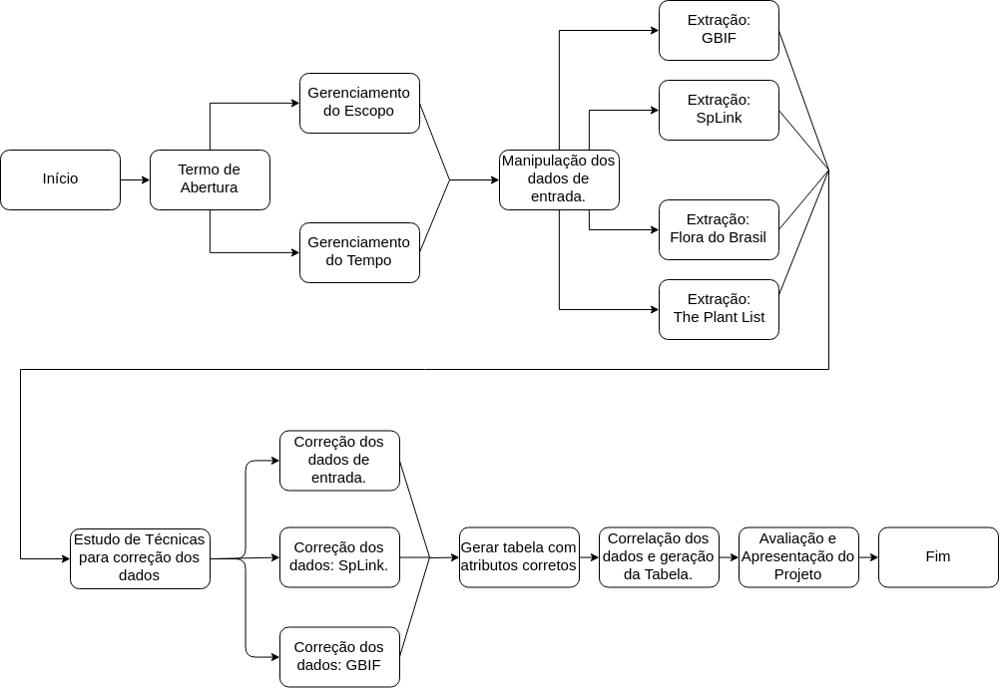

### Histórico de Revisão

| Data | Versão | Descrição | Autor(es) |
| :---: | :---: | --- | :---: |
| 20/09/2018 | 1.0 | Desenvolvimento do Plano de Tempo | Eduardo / Caio / Gabriel|
## Sumário

1. [Objetivo deste documento](#1-Objetivo-deste-documento)
2. [Atividades do Projeto](#2-Atividades-do-Projeto)    
  2.1. [Estimativa de Tempo (PERT)](#21-Estimativa-de-Tempo-(PERT))    
  2.2. [Associação aos Membros](#22-Associação-aos-Membros)    
3. [Ferramentas Utilizadas](#3-Ferramentas-Utilizadas)    
  3.1. [Diagrama de Gantt](#31-Diagrama-de-Gantt)    
  3.2. [Sequenciamento de Atividades](#32-Sequenciamento-de-Atividades)    
  3.3. [Issues](#33-Issues)    

# 1. Objetivo deste documento
O objetivo deste documento baseia-se na definição e alocação do tempo e recursos (desenvolvedores) às atividades, assim como a descrição dos softwares e ferramentas utilizadas para ajudar na construção do cronograma.

# 2. Atividades do Projeto

## 2.1 Estimativa de Tempo (PERT)
A estimativa de tempo para cada atividade foi calculada utilizando a estimativa de três pontos (pontos). A definição das horas de trabalho necessárias para cada atividade estão ilustradas na seguinte [Tabela](PERT.md).

## [Estimativa PERT](https://docs.google.com/spreadsheets/d/1tk6N9yP0x0Bd0S89-vvIxuFlra7wYxCrg-r4poAxl34/edit?usp=sharing)

    <table>
        <thead>
        <tr>
            <th class="row-header freezebar-origin-ltr"></th>
            <th id="1960473857C0" style="width:296px" class="column-headers-background">A</th>
            <th id="1960473857C1" style="width:83px" class="column-headers-background">B</th>
            <th id="1960473857C2" style="width:84px" class="column-headers-background">C</th>
            <th id="1960473857C3" style="width:78px" class="column-headers-background">D</th>
            <th id="1960473857C4" style="width:87px" class="column-headers-background">E</th>
        </tr>
        </thead>
        <tbody>
        <tr style='height:19px;'>
        </tr>
        <tr style='height:19px;'>
            <th id="1960473857R1" style="height: 19px;" class="row-headers-background">
                
1

            </th>
            <td class="s1">ATIVIDADE</td>
            <td class="s1">Pessimista</td>
            <td class="s1">Neutro</td>
            <td class="s1">Otimista</td>
            <td class="s1">Resultado</td>
        </tr>
        <tr style='height:19px;'>
            <th id="1960473857R2" style="height: 19px;" class="row-headers-background">
                
2

            </th>
            <td class="s1">Termo de Abertura do Projeto</td>
            <td class="s2" dir="ltr">8</td>
            <td class="s2" dir="ltr">5</td>
            <td class="s2" dir="ltr">2</td>
            <td class="s2">5</td>
        </tr>
        <tr style='height:19px;'>
            <th id="1960473857R3" style="height: 19px;" class="row-headers-background">
                
3

            </th>
            <td class="s1">Plano de Gerenciamento de Escopo</td>
            <td class="s2" dir="ltr">11</td>
            <td class="s2" dir="ltr">6</td>
            <td class="s2" dir="ltr">4</td>
            <td class="s2">6.5</td>
        </tr>
        <tr style='height:19px;'>
            <th id="1960473857R4" style="height: 19px;" class="row-headers-background">
                
4

            </th>
            <td class="s1">Plano de Gerencimanto de Tempo</td>
            <td class="s2" dir="ltr">11</td>
            <td class="s2" dir="ltr">6</td>
            <td class="s2" dir="ltr">4</td>
            <td class="s2">6.5</td>
        </tr>
        <tr style='height:19px;'>
            <th id="1960473857R5" style="height: 19px;" class="row-headers-background">
                
5

            </th>
            <td class="s1">Manipulação dos Dados de Entrada.</td>
            <td class="s2" dir="ltr">3</td>
            <td class="s2" dir="ltr">2</td>
            <td class="s2" dir="ltr">1</td>
            <td class="s2">2</td>
        </tr>
        <tr style='height:19px;'>
            <th id="1960473857R6" style="height: 19px;" class="row-headers-background">
                
6

            </th>
            <td class="s0"></td>
            <td class="s0"></td>
            <td class="s0"></td>
            <td class="s0"></td>
            <td class="s0"></td>
        </tr>
        <tr style='height:19px;'>
            <th id="1960473857R7" style="height: 19px;" class="row-headers-background">
                
7

            </th>
            <td class="s1">Extração dos dados: Flora do Brasil.</td>
            <td class="s2" dir="ltr">9</td>
            <td class="s2" dir="ltr">7</td>
            <td class="s2" dir="ltr">5</td>
            <td class="s2">7</td>
        </tr>
        <tr style='height:19px;'>
            <th id="1960473857R8" style="height: 19px;" class="row-headers-background">
                
8

            </th>
            <td class="s1">Extração dos dados: GBIF.</td>
            <td class="s2" dir="ltr">9</td>
            <td class="s2" dir="ltr">7</td>
            <td class="s2" dir="ltr">5</td>
            <td class="s2">7</td>
        </tr>
        <tr style='height:19px;'>
            <th id="1960473857R9" style="height: 19px;" class="row-headers-background">
                
9

            </th>
            <td class="s1">Extração dos dados: Splink.</td>
            <td class="s2" dir="ltr">21</td>
            <td class="s2" dir="ltr">16</td>
            <td class="s2" dir="ltr">5</td>
            <td class="s2">15</td>
        </tr>
        <tr style='height:19px;'>
            <th id="1960473857R10" style="height: 19px;" class="row-headers-background">
                
10

            </th>
            <td class="s1">Extração dos dados: The Plant List.</td>
            <td class="s2" dir="ltr">16</td>
            <td class="s2" dir="ltr">11</td>
            <td class="s2" dir="ltr">6</td>
            <td class="s2">11</td>
        </tr>
        <tr style='height:19px;'>
            <th id="1960473857R11" style="height: 19px;" class="row-headers-background">
                
11

            </th>
            <td class="s0"></td>
            <td class="s0"></td>
            <td class="s0"></td>
            <td class="s0"></td>
            <td class="s0"></td>
        </tr>
        <tr style='height:19px;'>
            <th id="1960473857R12" style="height: 19px;" class="row-headers-background">
                
12

            </th>
            <td class="s1 softmerge">
                
Estudo de técnicas para correção dos
                    dados.
                

            </td>
            <td class="s2" dir="ltr">10</td>
            <td class="s2" dir="ltr">7</td>
            <td class="s2" dir="ltr">4</td>
            <td class="s2">7</td>
        </tr>
        <tr style='height:19px;'>
            <th id="1960473857R13" style="height: 19px;" class="row-headers-background">
                
13

            </th>
            <td class="s1">Correção dos dados de entrada.</td>
            <td class="s2" dir="ltr">16</td>
            <td class="s2" dir="ltr">10</td>
            <td class="s2" dir="ltr">7</td>
            <td class="s2">10.5</td>
        </tr>
        <tr style='height:19px;'>
            <th id="1960473857R14" style="height: 19px;" class="row-headers-background">
                
14

            </th>
            <td class="s1">Correção dos dados: GBIF e Splink.</td>
            <td class="s2" dir="ltr">25</td>
            <td class="s2" dir="ltr">20</td>
            <td class="s2" dir="ltr">15</td>
            <td class="s2">20</td>
        </tr>
        <tr style='height:19px;'>
            <th id="1960473857R15" style="height: 19px;" class="row-headers-background">
                
15

            </th>
            <td class="s1 softmerge">
                
Gerar tabela de saída com os atributos
                    corretos.
                

            </td>
            <td class="s2" dir="ltr">5</td>
            <td class="s2" dir="ltr">3</td>
            <td class="s2" dir="ltr">1</td>
            <td class="s2">3</td>
        </tr>
        </tbody>
    </table>

## 2.2 Associação aos Membros
Para cada atividade foram associados as pessoas responsáveis pela execução da atividade em questão. Para isto, foram construídos o [diagrama de Gantt](updated_GANTTDiagram.pdf), assim como a criação de [Issues no GitHub](https://github.com/ltdagabriel/Database-Macrophytes/issues).

# 3. Ferramentas Utilizadas
Esta seção apresenta as ferramentas e softwares facilitadores utilizados, assim como suas funcionalidades.

## 3.1 Diagrama de Gantt
O [diagrama de Gantt](updated_GANTTDiagram.pdf) foi utilizado com o objetivo de associar os membros às tarefas, definir a data inicial e a data final para a realização das atividades, como também para cada uma das entregas. 

## 3.2 Sequenciamento de Atividades
O [sequenciamento das atividades](Diagrama_Sequenciamento.png) foi realizada com o objetivo de ilustrar e analisar a dependência e a relação entre as atividades definidas. A seguinte Figura ilustra tal relação entre as atividades.

## 3.3 Issues
A representação das atividades em [Issues](https://github.com/ltdagabriel/Database-Macrophytes/issues) do GitHub foi essencial para facilitar a visualização das tarefas a serem realizadas pelos membros selecionados. 